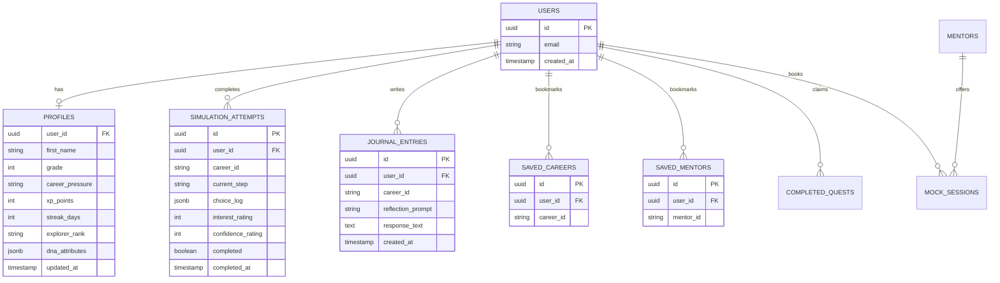
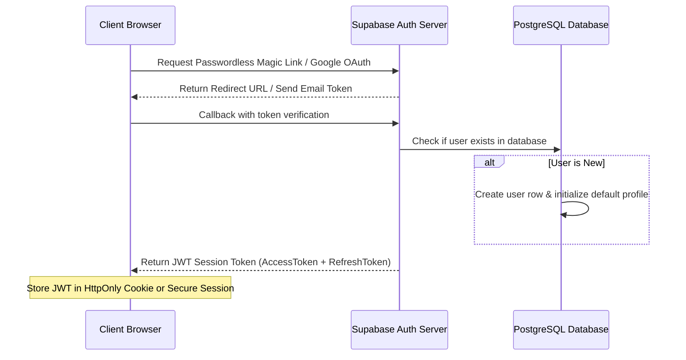
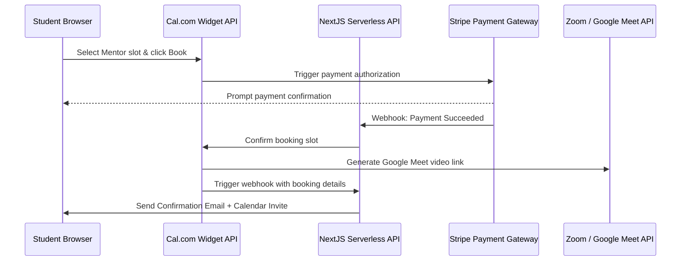

# CareerVerse Future Architecture Blueprint (V11)

This document outlines the technical design, database schemas, and API integration paths required to transition CareerVerse from a client-side localStorage MVP to a distributed, scalable, and intelligent cloud ecosystem.

---

## 1. Relational Database Schema (Supabase / PostgreSQL)

To replace localStorage serialization, we will utilize a PostgreSQL database managed via Supabase or Firebase Firestore. Below is the proposed relational schema:



---

## 2. Authentication Flow (OAuth 2.0 / Passwordless)



---

## 3. Real AI API Streaming Integration (Gemini / OpenAI)

To replace mock AI Coach responses with real LLM streams, we will configure an Edge API route:

```typescript
// File: /app/api/coaching/chat/route.ts
import { GoogleGenAI } from "@google/genai";
import { type NextRequest } from "next/server";

export const runtime = "edge";

const ai = new GoogleGenAI({ apiKey: process.env.GEMINI_API_KEY });

export async function POST(req: NextRequest) {
  const { messages, userProfile } = await req.json();

  // Inject user profile memory to establish context
  const systemInstruction = `
    You are the CareerVerse AI Coach. You help high school students (Grade 9-12) explore streams.
    Reference their unified profile stats:
    - Name: ${userProfile.name}
    - Grade: ${userProfile.grade}
    - DNA Style: ${userProfile.dna.workStyle} (Analytical: ${userProfile.dna.analytical}%, Creative: ${userProfile.dna.creativity}%)
    - Completed Journeys: ${userProfile.completedSimulations.join(", ")}
    - Bookmarked Goals: ${userProfile.goals.join(", ")}
    - Unlocked Skills: ${userProfile.unlockedSkills.join(", ")}

    Provide actionable steps, encourage self-reflection, and speak like a supportive startup mentor. Keep answers under 150 words.
  `;

  // Request streaming completion
  const response = await ai.models.generateContentStream({
    model: "gemini-2.5-flash",
    contents: messages,
    config: {
      systemInstruction,
      temperature: 0.7,
      maxOutputTokens: 800,
    }
  });

  // Convert response to standard web stream
  const encoder = new TextEncoder();
  const readable = new ReadableStream({
    async start(controller) {
      for await (const chunk of response) {
        const text = chunk.text;
        controller.enqueue(encoder.encode(text));
      }
      controller.close();
    }
  });

  return new Response(readable, {
    headers: { "Content-Type": "text/event-stream" }
  });
}
```

---

## 4. Mentor Marketplace Webhooks & Real Booking

To transition mock booking sessions to real calls (using Cal.com or Calendly widgets + Stripe payments):



---

## 5. Real-Time Community Discussion Rooms

For real-time user-to-user community threads, we will integrate Supabase Realtime Channels:

```typescript
// File: /hooks/use-community-room.ts
import { useEffect, useState } from "react";
import { createClient } from "@supabase/supabase-js";

const supabase = createClient(process.env.NEXT_PUBLIC_SUPABASE_URL!, process.env.NEXT_PUBLIC_SUPABASE_ANON_KEY!);

export function useCommunityRoom(roomName: string) {
  const [messages, setMessages] = useState<any[]>([]);

  useEffect(() => {
    // 1. Fetch historical thread records
    supabase
      .from("posts")
      .select("*")
      .eq("room_id", roomName)
      .order("created_at", { ascending: true })
      .then(({ data }) => {
        if (data) setMessages(data);
      });

    // 2. Subscribe to realtime broadcast events
    const channel = supabase
      .channel(`room:${roomName}`)
      .on("postgres_changes", { event: "INSERT", schema: "public", table: "posts", filter: `room_id=eq.${roomName}` }, (payload) => {
        setMessages((prev) => [...prev, payload.new]);
      })
      .subscribe();

    return () => {
      supabase.removeChannel(channel);
    };
  }, [roomName]);

  const sendMessage = async (userId: string, username: string, content: string) => {
    await supabase.from("posts").insert({
      room_id: roomName,
      user_id: userId,
      author_name: username,
      content_text: content,
      created_at: new Date().toISOString()
    });
  };

  return { messages, sendMessage };
}
```
